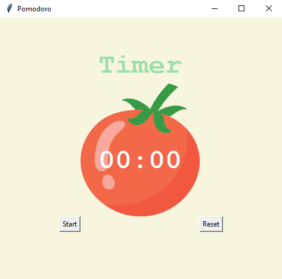

# Pomodoro

The Pomodoro Technique is a time management method developed by Francesco Cirillo in the late 1980s. In this technique you break up your work into intervals (usually 25 minutes each), followed by a short rest period of 5 to 10 minutes. It is intended to reduce the effects of internal and external interruptions on focus and flow whilst working.

With this timer app, you can easily track your Pomodoro sessions without having to manually set a timer. Begin a new Pomodoro session simply by running the application and pressing start. During the work and break intervals, your application dialog informs you what stage you're at. 




### Setup

#### Install the packages
You can install the included packages either directly through a package manager such as [pip](https://pypi.org/project/pip/) or via your IDE of choice. This project was created in [Python 3.9.1](https://www.python.org/downloads/release/python-391/).

### Run
No setup is required after installing the application's packages, simply run:
``` python main.py ```
